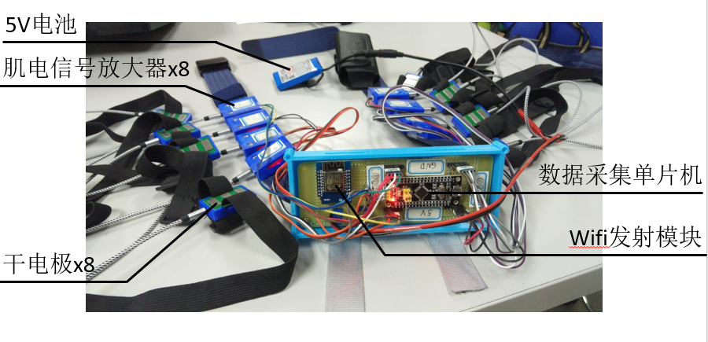
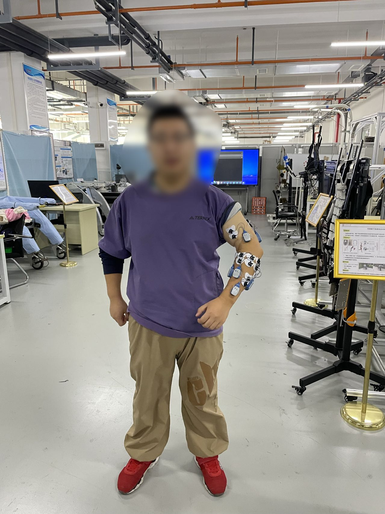

# sEMG-processing-software-design
# Project introduction
* In this project, the muscle signals of the upper extremity are acquired by an `8-channel` surface EMG signal sensor acquisition device.
* The software is built on `QT` and is used to perform data acquisition, Butterworth filtering of surface EMG signals, and visualization of results.
* This project focuses on `human gesture` recognition by detecting sEMG signals.
---
- 
---
- 
